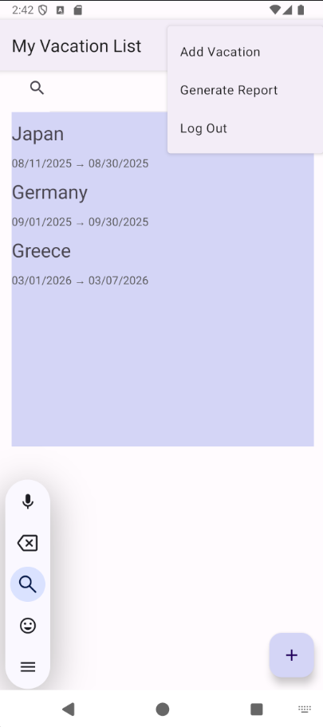
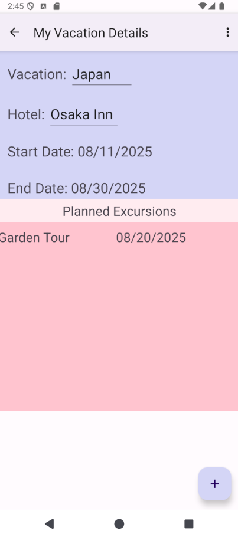
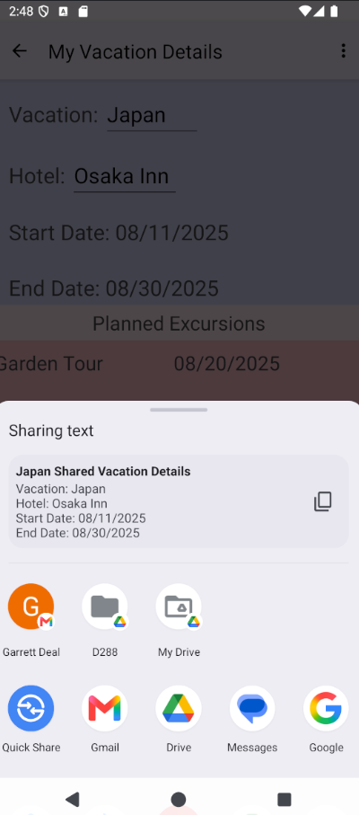
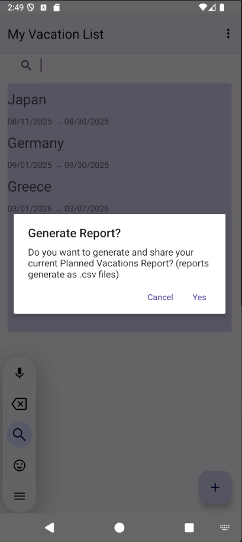

# Vacation Planner

A full-stack Android application developed for vacation and excursion planning.

## Features

- Create and manage vacations
- Track excursions
- Set vacation dates
- Local persistence using Room Database
- Notifications and reminders
- Input validation
- Repository architecture

## Technologies

- Java
- Android Studio
- Room Database
- SQLite
- RecyclerView
- MVVM Architecture

## Screenshots

### Login and Validation

### Vacation List

### Vacation Details

### Share Functionality

### Generate Reports

(Add screenshots here)

## Future Improvements

- Search functionality
- Enhanced reporting
- Cloud synchronization

## Author

Garrett Deal
